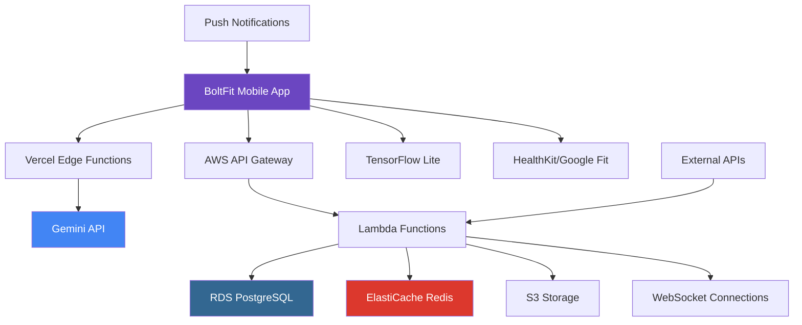

# High Level Architecture

## Technical Summary

BoltFit employs a mobile-first serverless architecture optimized for real-time engagement and offline reliability. The system combines React Native with Expo for cross-platform mobile development, integrates Google Gemini API for intelligent workout generation, and uses TensorFlow Lite for on-device rep counting to ensure privacy and performance. The backend leverages serverless functions for cost-effective scaling, supporting the freemium model with real-time social features through WebSocket connections and Redis caching.

## Platform and Infrastructure Choice

**Platform:** AWS with Vercel for frontend deployment
**Key Services:**

- AWS Lambda (serverless functions)
- AWS RDS PostgreSQL (user data, social features)
- AWS ElastiCache Redis (real-time features, session management)
- AWS S3 (media storage, workout content)
- Vercel (frontend deployment and edge functions)
  **Deployment Host and Regions:** Primary: US-East-1, Secondary: EU-West-1 for global user base

## Repository Structure

**Structure:** Monorepo using Turborepo
**Monorepo Tool:** Turborepo for optimal build caching and task orchestration
**Package Organization:** Apps (mobile), packages (shared UI, business logic, types), tools (build scripts, configs)

## High Level Architecture Diagram

## Architectural Patterns

- **Jamstack Architecture:** Static mobile app with serverless APIs - _Rationale:_ Optimal performance and scalability for mobile-first applications with real-time social features
- **Offline-First Pattern:** Local-first data with sync capabilities - _Rationale:_ Ensures reliability in gym environments with poor connectivity
- **Event-Driven Social Features:** Real-time updates through WebSocket and Redis pub/sub - _Rationale:_ Creates engaging social competition and immediate feedback
- **API Gateway Pattern:** Single entry point for all backend services - _Rationale:_ Centralized auth, rate limiting, and monitoring for freemium model
- **Repository Pattern:** Abstract data access logic - _Rationale:_ Enables testing and future database optimizations
